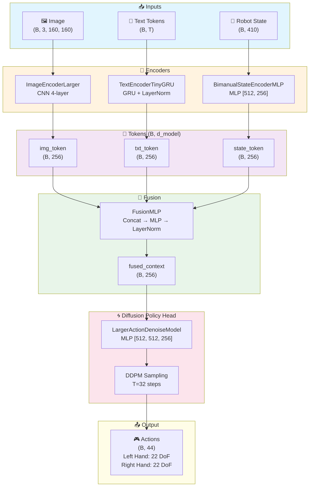
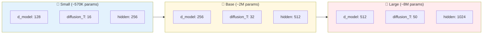

# mini-dex-vla

DexMachina 환경을 활용한 양손 Allegro Hand 조작을 위한 mini-VLA 구현 프로젝트.

## 개요

| 항목 | 내용 |
|------|------|
| **시뮬레이터** | Genesis (GPU 물리 시뮬레이션) |
| **로봇 손** | Allegro Hand × 2 (양손) |
| **Action Dim** | 16 DoF × 2 = 32 (양손 finger joints) |
| **데이터셋** | ARCTIC (인간 양손 조작 비디오) |
| **물체** | box, laptop, mixer, waffleiron 등 |

### 기존 mini-VLA와 비교

| 항목 | mini-VLA (Meta-World) | mini-dex-vla (DexMachina) |
|------|----------------------|---------------------------|
| Hand | 2-finger gripper | Allegro Hand × 2 |
| Action Dim | 4 | 32 (16 × 2) |
| State Dim | 39 | 95+ (양손 joints + object) |
| Task | Push, Pick | Bimanual manipulation |
| Simulator | MuJoCo | Genesis |

> 기존 mini-VLA 문서는 [README_MINI_VLA.md](README_MINI_VLA.md) 참조

---

## 모델 아키텍처

DexMachina VLA는 이미지, 텍스트, 로봇 상태를 융합하여 Diffusion Policy로 action을 생성합니다.



### 주요 컴포넌트

| 컴포넌트 | 클래스 | 설명 |
|---------|--------|------|
| Image Encoder | `ImageEncoderLarger` | 4-layer CNN, Global Average Pooling |
| Text Encoder | `TextEncoderTinyGRU` | Embedding + GRU + LayerNorm |
| State Encoder | `BimanualStateEncoderMLP` | 깊은 MLP (410→512→256→d_model) |
| Fusion | `FusionMLP` | 3개 토큰 concat → MLP |
| Diffusion Head | `LargerDiffusionPolicyHead` | DDPM with 512-dim hidden |

### 모델 크기별 설정



### 파일 구조

```
models/
├── vla_dexmachina.py      # VLADexMachinaPolicy (메인 모델)
├── encoders.py            # Image/Text/State 인코더
├── fusion.py              # FusionMLP
└── diffusion_head.py      # Diffusion Policy Head
```

---

## 설치

### 1. Conda 환경 생성

```bash
conda create -n mini-vla python=3.10
conda activate mini-vla
```

### 2. PyTorch 설치

```bash
pip install torch==2.5.1
```

### 3. Genesis (커스텀 포크) 설치

```bash
cd ~/Documents
git clone https://github.com/MandiZhao/Genesis.git
cd Genesis && pip install -e .
pip install libigl==2.5.1
```

### 4. rl_games (커스텀 포크) 설치

```bash
cd ~/Documents
git clone https://github.com/MandiZhao/rl_games.git
cd rl_games && pip install -e .
```

### 5. 추가 패키지 설치

```bash
pip install gymnasium ray seaborn wandb trimesh moviepy==1.0.3
```

### 6. DexMachina 설치

```bash
cd ~/Documents
git clone https://github.com/MandiZhao/dexmachina.git
cd dexmachina && pip install -e .
```

### 7. 호환성 수정

#### NumPy 다운그레이드 (Genesis 호환)
```bash
pip install "numpy<2.0"
```

#### wandb 업그레이드 (NumPy 1.x 호환)
```bash
pip install --upgrade wandb
```

#### torch.load 수정 (PyTorch 2.6+ 호환)

`dexmachina/envs/demo_data.py` 87번째 줄 수정:
```python
# 변경 전
data = torch.load(data_fname)

# 변경 후
data = torch.load(data_fname, weights_only=False)
```

#### Genesis inertial_quat None 처리

`Genesis/genesis/engine/solvers/rigid/rigid_solver_decomp.py` 639-640번째 줄 수정:
```python
# 변경 전
links_inertial_pos=np.array([link.inertial_pos for link in links], dtype=gs.np_float),
links_inertial_quat=np.array([link.inertial_quat for link in links], dtype=gs.np_float),

# 변경 후
links_inertial_pos=np.array([link.inertial_pos if link.inertial_pos is not None else [0.0, 0.0, 0.0] for link in links], dtype=gs.np_float),
links_inertial_quat=np.array([link.inertial_quat if link.inertial_quat is not None else [0.0, 0.0, 0.0, 1.0] for link in links], dtype=gs.np_float),
```

#### Genesis contact_data 경로 수정

`dexmachina/envs/contacts.py` 179-181번째 줄 수정:
```python
# 변경 전
contact_data = entity_a._solver.collider.contact_data
n_contacts = entity_a._solver.collider.n_contacts.to_torch(device=device)

# 변경 후
contact_data = entity_a._solver.collider._collider_state.contact_data
n_contacts = entity_a._solver.collider._collider_state.n_contacts.to_torch(device=device)
```

---

## 설치 확인

### Genesis 확인
```bash
python -c "import genesis as gs; print('Genesis version:', gs.__version__)"
```

### DexMachina 확인
```bash
python -c "import dexmachina; print('DexMachina imported successfully!')"
```

### 디렉토리 구조

```
~/Documents/
├── Genesis/              # Genesis 시뮬레이터
├── rl_games/             # RL 학습 프레임워크
├── dexmachina/           # DexMachina 환경
│   └── dexmachina/
│       ├── assets/
│       │   ├── allegro_hand/      # Allegro Hand URDF
│       │   ├── arctic/            # ARCTIC 물체 assets
│       │   └── retargeted/        # Retargeted 데모 데이터
│       ├── envs/                  # 환경 코드
│       └── rl/                    # RL 학습 코드
└── mini-vla/             # 이 프로젝트
```

### 사용 가능한 데이터

| Hand | Subject | Object | 파일 |
|------|---------|--------|------|
| allegro_hand | s01 | box | box_use_01_vector_para.pt |
| allegro_hand | s01 | mixer | mixer_use_01_vector_para.pt |
| allegro_hand | s01 | waffleiron | waffleiron_use_01_vector_para.pt |

---

## 데이터 수집

ARCTIC demonstration을 사용하여 mini-VLA 학습 데이터 수집:

```bash
python -m scripts.collect_dexmachina_data \
    --task-name box \
    --clip-range 30-230 \
    --episodes 10 \
    --output-path data/dexmachina_box.npz
```

### 옵션

| 옵션 | 기본값 | 설명 |
|------|--------|------|
| `--task-name` | box | ARCTIC 물체 (box, mixer, waffleiron) |
| `--hand-type` | allegro_hand | 로봇 손 타입 |
| `--clip-range` | 30-230 | 프레임 범위 |
| `--episodes` | 10 | 에피소드 수 |
| `--render` | False | 이미지 렌더링 활성화 |
| `--instruction` | auto | 태스크 instruction |

### 출력 데이터 형식

```python
# dexmachina_box.npz
{
    "images": (N, 160, 160, 3),  # RGB uint8
    "states": (N, 410),          # float32
    "actions": (N, 44),          # float32
    "text_ids": (N, T),          # int64
    "vocab": dict,
    "metadata": dict,
}
```

---

## RL 학습 테스트

DexMachina RL 학습 테스트:

```bash
cd ~/Documents/dexmachina
python dexmachina/rl/train_rl_games.py \
  -B 64 \
  --max_epochs 10 \
  --clip box-30-230 \
  --horizon 4 \
  --hand allegro_hand \
  --retarget_name para \
  -exp test_run
```

출력 예시:
```
fps step: 398 fps step and policy inference: 380 fps total: 369 epoch: 1/10
```

---

## 참고 자료

- [DexMachina GitHub](https://github.com/MandiZhao/dexmachina)
- [DexMachina 문서](https://mandizhao.github.io/dexmachina-docs)
- [DexMachina 논문](https://arxiv.org/abs/2505.24853)
- [Genesis GitHub](https://github.com/MandiZhao/Genesis)
- [ARCTIC 데이터셋](https://arctic.is.tue.mpg.de/)

---

## DexMachina 환경 래퍼

mini-VLA 인터페이스용 래퍼 (`envs/dexmachina_env.py`):

```python
from envs.dexmachina_env import DexMachinaWrapper

env = DexMachinaWrapper(
    task_name='box',           # ARCTIC 물체 (box, mixer, waffleiron)
    hand_type='allegro_hand',  # 로봇 손 타입
    num_envs=1,
    clip_range="30-100",       # 프레임 범위
)

# State/Action 차원
print(f"State dim: {env.state_dim}")   # 410
print(f"Action dim: {env.action_dim}") # 44

# Reset
image, state, info = env.reset()

# Step
action = np.zeros(env.action_dim, dtype=np.float32)
image, state, reward, done, info = env.step(action)
```

---

## 체크포인트 및 평가

RL 학습 체크포인트 위치:
```
logs/rl_games/allegro_hand/[RUN_NAME]/nn/allegro_hand.pth
```

평가 실행:
```bash
CK=logs/rl_games/allegro_hand/RUN_NAME/nn/allegro_hand.pth
python dexmachina/rl/eval_rl_games.py -B 1 --checkpoint $CK -v
```

---

## 모델 학습

수집된 데이터로 VLA 모델 학습:

```bash
python -m scripts.train_dexmachina \
    --dataset-path data/dexmachina_box.npz \
    --epochs 100 \
    --batch-size 64 \
    --model-size base \
    --save-path checkpoints/dexmachina_model.pt
```

### 모델 크기 옵션

| 모델 | d_model | diffusion_T | 파라미터 수 |
|------|---------|-------------|------------|
| small | 128 | 16 | ~570K |
| base | 256 | 32 | ~2M |
| large | 512 | 50 | ~8M |

### 학습 옵션

| 옵션 | 기본값 | 설명 |
|------|--------|------|
| `--epochs` | 100 | 학습 에포크 수 |
| `--batch-size` | 64 | 배치 크기 |
| `--lr` | 1e-4 | 학습률 |
| `--model-size` | base | 모델 크기 (small/base/large) |
| `--warmup-epochs` | 5 | Warmup 에포크 수 |
| `--grad-clip` | 1.0 | Gradient clipping |
| `--resume` | None | 체크포인트에서 재개 |

### 체크포인트 구조

```python
{
    "model_state_dict": ...,
    "vocab": dict,
    "state_dim": 410,
    "action_dim": 44,
    "model_size": "base",
    "action_stats": {"mean": ..., "std": ...},
    "epoch": int,
    "loss": float,
}
```

---

## 모델 평가

학습된 VLA 모델 평가:

```bash
python -m scripts.eval_dexmachina \
    --checkpoint checkpoints/dexmachina_model.pt \
    --task-name box \
    --clip-range 30-230 \
    --episodes 5 \
    --compare-expert
```

### 평가 옵션

| 옵션 | 기본값 | 설명 |
|------|--------|------|
| `--checkpoint` | (필수) | 학습된 체크포인트 경로 |
| `--task-name` | box | 평가 태스크 |
| `--episodes` | 5 | 평가 에피소드 수 |
| `--compare-expert` | False | Expert action과 비교 |
| `--save-video` | False | 비디오 저장 |
| `--no-render` | False | 렌더링 비활성화 |

### 출력 예시

```
Evaluation Summary
==================================================
  Task: box
  Episodes: 5
  Mean Reward: 0.0000 +/- 0.0000
  Mean Action MSE: 0.244146 +/- 0.002286
==================================================
```

---

## TODO

- [x] Genesis scene.build() 이슈 해결
- [x] DexMachina 환경 래퍼 구현 (`envs/dexmachina_env.py`)
- [x] 데이터 수집 파이프라인 구축 (`scripts/collect_dexmachina_data.py`)
- [x] 모델 확장 (state_dim=410, action_dim=44)
- [x] 학습 스크립트 (`scripts/train_dexmachina.py`)
- [x] 평가 스크립트 (`scripts/eval_dexmachina.py`)
